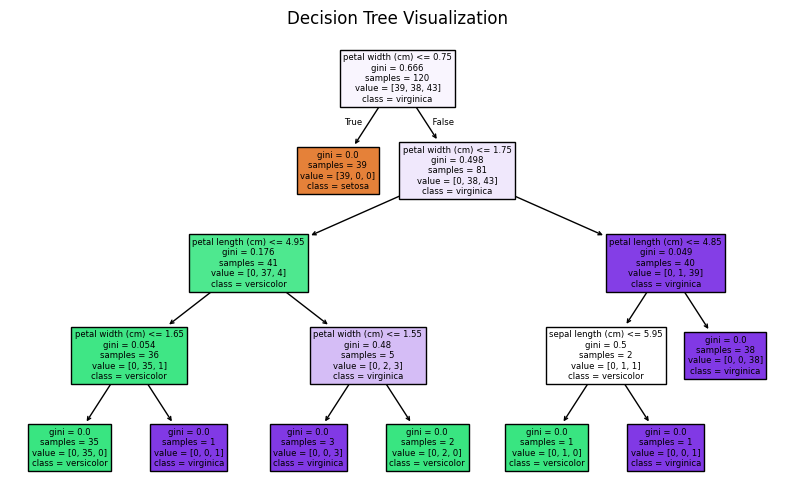

# Task 1: Decision Tree Classifier using Iris Dataset

## Introduction

This project demonstrates the implementation of a Decision Tree Classifier using the Iris dataset. Decision Trees are supervised machine learning algorithms used for classification tasks. They are easy to understand and visualize, making them ideal for beginners in machine learning.

## Objective

The objective of this project is to build a model that can classify iris flowers into three species: Setosa, Versicolor, and Virginica based on their measurements.

## Dataset

The dataset used is the Iris dataset, which contains 150 samples with four features:

* Sepal length
* Sepal width
* Petal length
* Petal width

Each sample belongs to one of three classes.

## Methodology

First, the dataset was loaded using sklearn. Then, it was divided into training and testing sets. A Decision Tree Classifier model was created and trained using the training data. After training, predictions were made on the test data and evaluated using accuracy score.

## Model Explanation

The Decision Tree algorithm works by splitting the dataset based on feature values. It selects the best feature at each step to improve classification accuracy. The final structure looks like a tree where each branch represents a decision.

## Results

The model achieved a good accuracy score. The visualization below shows how the decision tree classifies the data.

## Conclusion

This project shows how Decision Trees can be used for classification problems. It is simple, interpretable, and effective for small datasets.

## Tools Used

* Python
* Scikit-learn
* Matplotlib
* Google Colab
